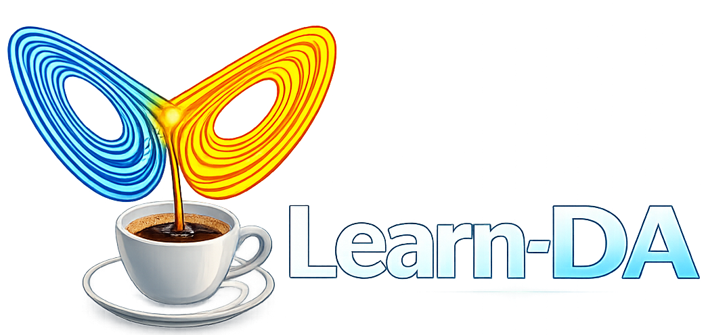

<div align="center">



# Learn-DA

### Ensemble Data Assimilation & Atmospheric Modeling — in your browser.

[](https://react.dev)
[](https://fastapi.tiangolo.com)
[](https://python.org)
[](https://docs.docker.com/compose/)
[](LICENSE)

[🌐 Live Platform](http://www.learn-da.com) · [📚 DA Course](https://enino84.github.io/courses/intro_data_assimilation/) · [🧪 PyTEDA Lab](http://www.learn-da.com:8000/)

</div>

---

## ✨ What is Learn-DA?

**Learn-DA** is an open scientific platform that makes **ensemble data assimilation** and **atmospheric modeling** accessible to everyone — PhD students, university professors, research teams, and energy industry professionals — without requiring institutional infrastructure or complex setup.

> *"Make ensemble data assimilation and atmospheric modeling transparent, accessible, and genuinely useful — for science, for education, and for the real world."*
> — **Elías D. Niño-Ruiz, Ph.D.** · CEO & Founder, Learn-DA

---

## 🚀 Features

- **🧪 PyTEDA Interactive Lab** — Run Lorenz-96 ensemble DA experiments live in the browser. Compare EnKF, LETKF, and 10+ variants side-by-side in real time with streaming results.
- **📐 10 DA Methods** — EnKF, EnKF-B-Loc, EnKF-Cholesky, EnKF-Modified-Cholesky, EnKF-Naive, EnKF-Shrinkage, EnSRF, ETKF, LEnKF, LETKF — all documented with references.
- **🌩️ Regional Climate Models** *(coming soon)* — High-resolution mesoscale WRF simulations over Colombia and the Caribbean.
- **🌍 Global Atmospheric Models** *(coming soon)* — Planetary-scale SPEEDY AT-GCM experiments.
- **📚 DA Course** — Structured learning path from fundamentals to ensemble Kalman filters with interactive exercises.
- **📦 PyTEDA Python Package** — `pip install pyteda` for local Jupyter notebooks, teaching demos, and reproducible research.

---

## 🏗️ Architecture

```
┌──────────────────────────────────────────────────────┐
│                      Browser                         │
│  React 18 · Vite · Framer Motion                     │
│                                                      │
│  ConfigCard ──► method selection & parameters        │
│  RunCard    ──► streaming charts via SSE             │
│    ├── 📈 Analysis Error                             │
│    ├── 📉 Background vs Analysis                     │
│    ├── 🌊 Ensemble Spread Evolution                  │
│    ├── 🎻 RMSE Distribution Violin                   │
│    └── 📊 Radar · Polar · Bar · Pareto               │
└──────────────────────┬───────────────────────────────┘
                       │ HTTP / SSE
┌──────────────────────▼───────────────────────────────┐
│                  FastAPI Backend                      │
│                                                      │
│  GET  /api/methods          → method list + schemas  │
│  POST /api/runs             → create run, return id  │
│  GET  /api/runs/{id}/stream → SSE real-time stream   │
│  GET  /api/runs/{id}/csv    → download results       │
└──────────────────────┬───────────────────────────────┘
                       │
┌──────────────────────▼───────────────────────────────┐
│              TEDA Python Library                     │
│   LETKF · EnKF variants · Lorenz-96 · RK4            │
└──────────────────────┬───────────────────────────────┘
                       │ asyncpg
┌──────────────────────▼───────────────────────────────┐
│                   PostgreSQL                         │
│        runs · method_instances · results             │
└──────────────────────────────────────────────────────┘
```

---

## 🛠️ Tech Stack

| Layer | Technology |
|---|---|
| Frontend | React 18, Vite, Framer Motion |
| Backend | FastAPI, Uvicorn, Python 3.11+ |
| DA Engine | PyTEDA (TEDA Python Library) |
| Database | PostgreSQL |
| Serving | Nginx (frontend), Uvicorn (API) |
| Deployment | Docker Compose |

---

## ⚡ Quick Start

### Prerequisites

- [Docker](https://docs.docker.com/get-docker/) and [Docker Compose](https://docs.docker.com/compose/install/)

### 1. Clone the repository

```bash
git clone https://github.com/enino84/learn-da-react.git
cd learn-da-react
```

### 2. Run with Docker Compose

```bash
docker compose up -d
```

The platform will be available at **http://localhost** (port 80).

### 3. Rebuild after changes

```bash
docker compose build --no-cache frontend && docker compose up -d --force-recreate frontend
```

---

## 🧑‍💻 Local Development

### Frontend

```bash
cd frontend
npm install
npm run dev
# → http://localhost:5173
```

### Backend

```bash
cd backend
pip install -r requirements.txt
uvicorn main:app --reload --port 8000
# → http://localhost:8000
```

---

## 📁 Project Structure

```
learn-da-react/
├── docker-compose.yml
├── frontend/
│   ├── Dockerfile
│   ├── public/
│   │   ├── logo.png
│   │   ├── hero-bg.jpg
│   │   └── ...
│   ├── src/
│   │   ├── App.jsx          # Main application — all sections
│   │   └── index.css        # Global styles & design tokens
│   ├── package.json
│   └── vite.config.js
└── backend/
    ├── Dockerfile
    ├── main.py              # FastAPI app & routes
    └── requirements.txt
```

---

## 🔬 Supported DA Methods

| Method | Type | Reference |
|---|---|---|
| `enkf` | Stochastic EnKF | Evensen (2009) |
| `enkf-b-loc` | EnKF + B-localization | Greybush et al. (2011) |
| `enkf-cholesky` | EnKF + Cholesky solve | Mandel (2006) |
| `enkf-modified-cholesky` | EnKF + precision via Mod. Cholesky | Niño-Ruiz, Sandu & Deng (2018) |
| `enkf-naive` | Efficient EnKF (Sherman-Morrison) | Niño-Ruiz, Sandu & Anderson (2015) |
| `enkf-shrinkage-precision` | EnKF + shrinkage precision | Niño-Ruiz & Sandu (2015) |
| `ensrf` | Ensemble Square Root Filter | Tippett et al. (2003) |
| `etkf` | Ensemble Transform KF | Bishop, Etherton & Majumdar (2001) |
| `lenkf` | Local EnKF | Ott et al. (2004) |
| `letkf` | Local ETKF | Hunt, Kostelich & Szunyogh (2007) |

---

## 🌐 Deployment (Production)

The `docker-compose.yml` is production-ready. Frontend is served by **Nginx on port 80**, backend API on **port 8000**.

```bash
# On your server
git pull
docker compose down
docker compose up -d --build
```

To use a custom domain, point your DNS A record to your server IP. For HTTPS, add a reverse proxy (e.g. Caddy or Nginx) in front with Let's Encrypt.

---

## 👤 Author

**Elías D. Niño-Ruiz, Ph.D.**
CEO & Founder, Learn-DA

- 🌐 [learn-da.com](http://www.learn-da.com)
- 📧 elias.d.nino@gmail.com
- 🎓 [DA Course](https://enino84.github.io/courses/intro_data_assimilation/)

---

## 📄 License

MIT © 2025 Learn-DA · Elías D. Niño-Ruiz

---

<div align="center">
  <sub>Built with ❤️ for the data assimilation and atmospheric science community.</sub>
</div>
